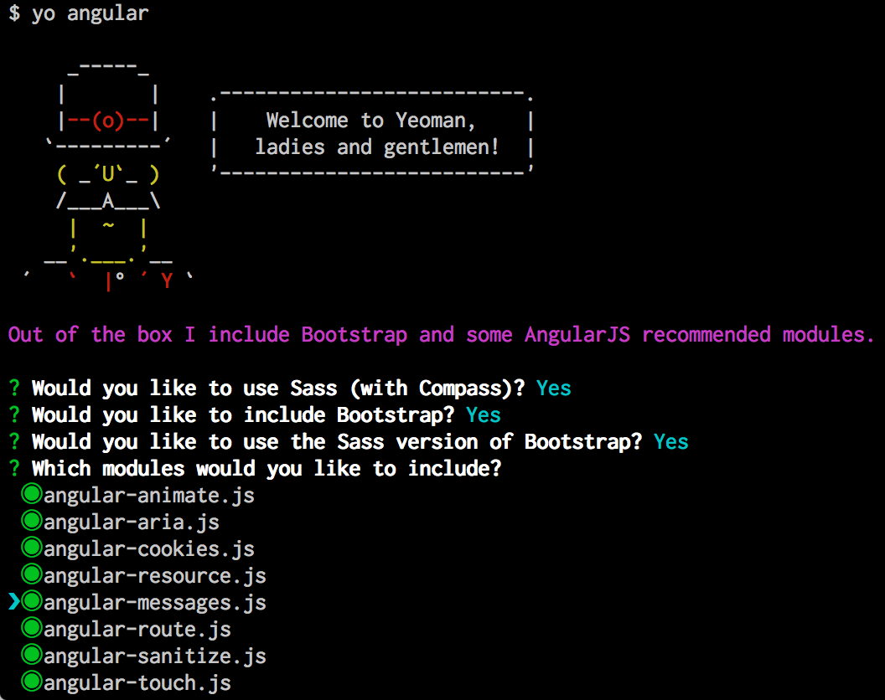

# Boostrap Your AngularJS Project
Bootstrapping your AngularJS project is just like boostrapping any other project using Yeoman. Once you've installed `generator-angular`, you will want to bootstrap your project.

## Preparing to bootstrap the project
Previously, we had bootstrapped our projects into a Git repository we had already made. Make a new Git repository and clone it to your development space. If you generate a repository on Github it will ask you if you want to make a README file. You do not need to create one, but you may if you wish.

Clone the repository you created on Github to a location where none of the parent directories have Yeoman projects inside of them. Open your terminal and change to the root directory of your project. 

Throughout the rest of this book, I'm going to make the assumption that you have the following structure for your work space:

`~/Projects/angular-app/`

I'm assuming that you have your home directory (represented by the `~` symbol), a `Projects` directory (which contains all your development work), and then your repository (which is called `angular-app`). Whenever you see this path, you can know I'm just referencing the root directory of your AngularJS webapp repository.

Now that you're in the right location, run the bootstrap command:

```bash
yo angular
```



That will bring up the standard Yeoman bootstrap interface. Answer all the questions Yes (even the one about using Compass) and select all the Angular modules: we will explore many of them. 

Once you hit enter after selecting all the modules, Yeoman will proceed to build out the project.

**Please Note:** At the time of writing, there is a small issue where you may be prompted to overwrite `package.json` at some point during the installation process. This is an issue with the `generator-angular` scripts, and you should answer `Y` to overwrite the file. Unfortunately, during the installation, when it prompts you to enter that response, there is not time to actually do so. Keep watching the progress on the bootstrapping and **eventually it will stop and look like it has frozen up**. The process hasn't actually froze. In order to continue, type "Y" and press `return`. You should see the final results of the bootstrap process ending with a success message.