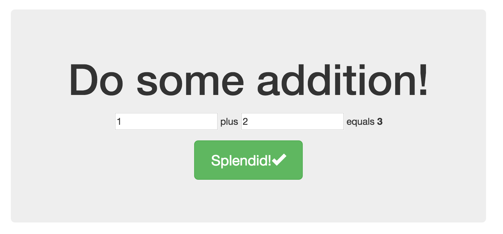

# Change Making
In order to get a little taste of how the AngularJS views system works, we will make some simple changes to our views. 

First, open the `app/views/main.html` file. Notice that it contains the familiar HTML defining the jumbotron and "'Allo! 'Allo!" message we see on so many Yeoman templates. Change some of the text to custom text of your own. (Don't overthink it!) 

Notice that when you save changes to this file, your web browser preview will update. (You did run `grunt serve` in your project directory before starting to make changes, right?)

Since this project has Bootstrap connected, you can use Bootstrap-specific styles or HTML structures to modify your page. Try making a few changes.

Once you're satisfied that you see how `main.html` is working, open `app/views/about.html` and make some changes there, too. Click back and forth between the Home and the About screens. Do you see how your changes are being inserted into a very specific place in your application? This is the area that your views have to work with.

If you feel like you're running on steam and you need to conclude this phase of our project, feel free to continue. But if you'd like to experiment with a simple AngularJS-powered enhancement to a template, then try this extra stretch goal.

## Stretch Goal: Make an adding machine.
To test out some of the core features of AngularJS, we will recreate the example we had in the previous chapter.

To do this, we will add a couple of `<input>` elements and then do a little math using the AngularJS template tags. 

Paste this code somewhere in either your `main.html` or `about.html` files:

```html
<div ng-app ng-init="firstnum=1;secondnum=2">
  <input type="number" min="0" ng-model="firstnum">
    plus
  <input type="number" min="0" ng-model="secondnum">
    equals 
  <b>{{firstnum + secondnum}}</b>
</div>
```

We will get into these concepts in more depth in coming chapters, but for now, here is a brief explanation of what's happening in that code (and this matches with the information we saw about [Models](frameworks_overview/ng_models.md) in the previous chapter).

First, we make a `<div>` element and we add the `ng-app` attribute to let AngularJS know that inside this `<div>` is going to be an AngularJS app.

Then we add in a couple of `<input>` elements. Each input defines a new variable, which AngularJS calls a "model", so we use the `ng-model` attribute to assign a name to whatever value gets typed into those `<input>` elements.

Finally, we output the sum of the two numbers. AngularJS templates use the double curly brace (`{{ ... }}`) syntax to output the value of a variable to the template. Hence, the `{{firstnum + secondnum}}` line. Notice that output is going to return a number. We could put whatever tags around it we want. Right now, there are `<b>` tags around it, but you could just as easily turn it into a Bootstrap label by changing it to something like this:

```html
<span class="label label-success">{{firstnum + secondnum}}</span>
```

When you preview this in your browser you should see something like this:



Type in two numbers and the sum total will change on its own. This is one of the cool things about AngularJS. We will dive into much more as we continue to explore.
