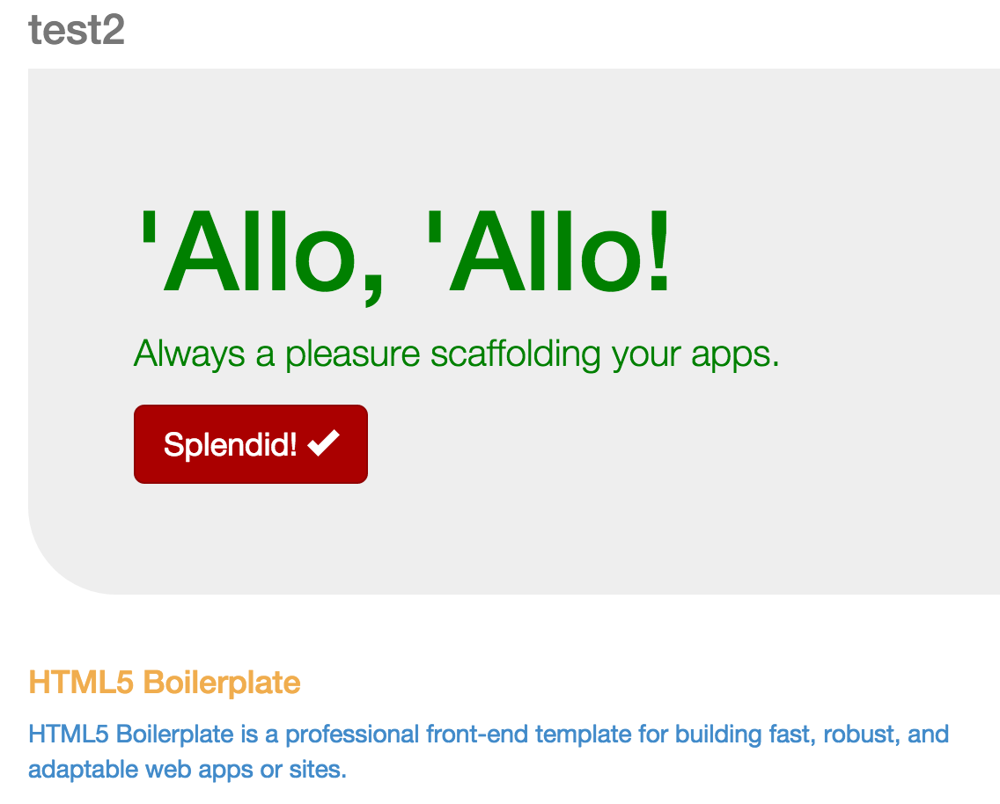
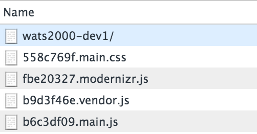
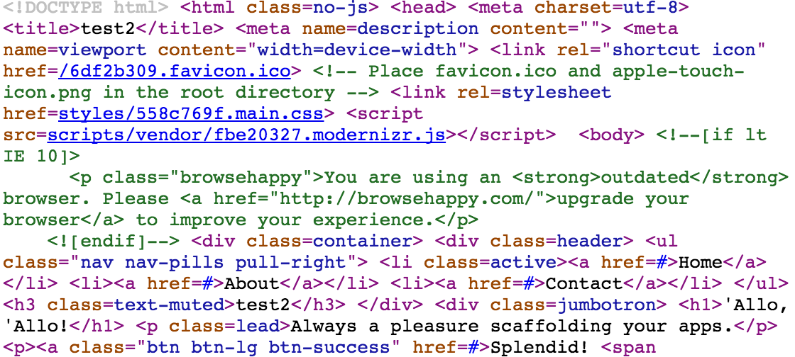

# Après Deployment
Now that you've deployed your project, when you visit the URL shown in our Github Pages Settings box, you should see something like this:

This shows the changes we made in the last chapter to everyone. If you inspect this deployment you will see several things that are different from when you normally preview your site using your local server.

## File combination and versioning
Part of the value of a tool like SASS is that it allows us to edit many files (so we have the benefit of good file organization) but combine those before delivery so our users only have to download one file (which makes a huge difference in how fast our site downloads). If you look at the files being downloaded for our site, you will notice there are only a few of them:

Note that there is only one `main.css` file, in spite of the fact that we are now editing three different files for our styles (`main.scss`, `_content.scss`, and `_variables.scss`). Our SASS processor (`node-sass`) has helpfully combined all those files for us.

Likewise, the Javascript from our third party ("vendor") components has also been gathered up into a single file. Some components must remain separate, such as `modernizr.js`, and we want to keep our code separate from vendor code (hence the `main.js` and `vendor.js`), but we have still saved our users from making several other file requests form our server. That means they each have received our website more quickly than they otherwise would have.

Also note that these filenames have big numbers in front of them. This is a form of file versioning that helps us make sure our users are always getting the latest version of our site. When working with Javascript and CSS files, the caching technology of the web can make it difficult for users to get the latest versions of those files after we have made updates. There are many systems in place to help this process along, but in the end the best way to make sure users receive the correct files is to make sure each one has a uniquely versioned name.

Unfortunately, thinking about versions and re-linking files because we changed the name is not something we want to fuss with as developers. So we offload this task to a Grunt task and let it be: no fuss required. Yay for tools!

## Minification
All HTML, CSS and Javascript is "minified" when we deploy. This means that extra spaces, linefeeds, and other formatting niceties are removed to make the file as small as possible. In some situations it might even involve rewriting the names of variables or functions to be shorter and smaller. There are many ways that minification helps compress files to make them as small as possible so they can be delivered to our users as quickly as possible.

Here is an example of what HTML looks like after it has been minified:

If you use the "Inspect Element" tool in your browser, then you will still see the HTML broken into a nice visual display, but that's because the developer tools are able to reformat the HTML. When you view source, you will see the compressed HTML like you see above.

## More
More happens when we build the site, too. Tests are run. If they fail, it will cause us issues. Fortunately, we have no tests written, so that cannot prevent us from deploying. But when we get around to adding tests to our project, that will be a great way to help us not make a mistake by deploying broken code.

Grunt is also looking at all of our images and trying to optimize those. Right now we are not using any images, but if we did then they would be optimized and compressed as much as possible before deployment. This is a good thing for our users.

There are many other things that Grunt can do for us as part of the build and deployment process. As you encounter challenges in your development, keep in mind the things Grunt can do for you and on the lookout for opportunities to get more out of a tool you're already using.