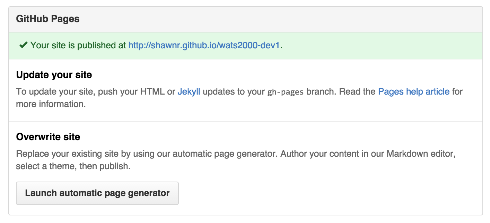

# Using `grunt-build-control`
Now that you have installed and configured `grunt-build-control` in your project, you can deploy your site to Github Pages for all the world to see. Huzzah!

## Review and commit your changes
In order to help you maintain a somewhat more sane approach to deploying your projects, `grunt-build-control` will not work when you have outstanding changes to files that are part of your repository. In order to deploy your work, you will need to commit all of your changes.

(NOTE: If you need a refresher on how to do this, refer to the [Git Reference](appendix/git_reference.md) in the appendix.)

## Build your project
Build the latest version of your project using the `build` task:

```
grunt build
```

This will update all the files in our `dist/` directory with the latest changes. 

## Deploy your project
Now you are ready to deploy. Run the `buildcontrol` task to deploy:

```
grunt buildcontrol
```

That command will kick off the deployment process. You will see some information scroll down the screen, and it should all end up with a message that looks something like this:

```bash
Pushing gh-pages to git@github.com:shawnr/wats2000-dev1.git
To git@github.com:shawnr/wats2000-dev1.git
 * [new branch]      gh-pages -> gh-pages

Done, without errors.


Execution Time (2015-07-06 22:14:58 UTC)
loading tasks       1.1s  ▇▇▇▇▇▇▇▇ 16%
buildcontrol:pages  5.9s  ▇▇▇▇▇▇▇▇▇▇▇▇▇▇▇▇▇▇▇▇▇▇▇▇▇▇▇▇▇▇▇▇▇▇▇▇▇▇▇▇▇▇▇▇▇▇▇▇▇ 84%
Total 7s
```

Once you're done, you should return to the Github page for your repository. You should see the new `gh-pages` branch has been created by `grunt-build-control`. If you click into the "settings" page for your repository, you should see that your site built successfully on Github Pages:



If there is an issue with deploying your site, then Github will alert you in that box. Usually if there is an issue with deploying your site you can fix it by making a small modification and re-deploying.

If you see the green bar, you should click the URL and visit your newly deployed website!

