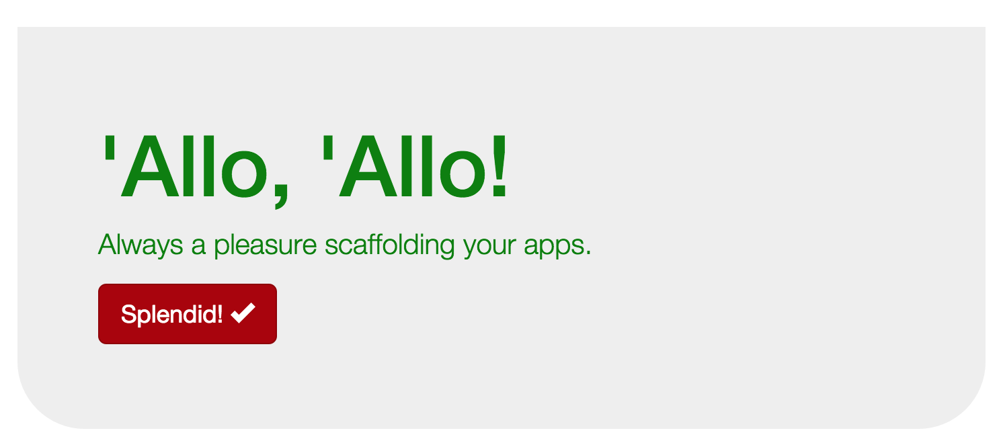

# Making the Most of Mixins

Mixins are powerful tools, and you should consider them in two ways:

1.  You can create a mixin to handle any repetitive code generation task that can be defined with logic. The mechanisms provided to create, essentially, "CSS functions" are very handy.
2.  You can use mixins created by others, and if you're working with a CSS framework, then it is likely to offer you mixins to use.

Since we're working with Bootstrap, we have lots of mixins at our disposal. We can learn from them. We can also take existing mixins and modify functionality to create our own.

Most of the time, we keep mixins in a separate file (or multiple files) so we don't get them lost in our stylesheets. Bootstrap stores its mixins in a `mixins/` directory containing many files.

You should be able to find the Bootstrap mixins directory in your project in:

```bash
bower_components/bootstrap-sass-official/assets/stylesheets/bootstrap/mixins/
```

As you look through that directory, you will notice many mixins. You can use the mixins in the `_grid-framework.scss` file to easily add grid-like features to your own styles. Or the mixins in the `_gradients.scss` file to create background gradients for your own styles. Let's examine the `_border-radius.scss` file to see the four mixins designed to make it easier for you to apply custom `border-radius` styles:

```sass
@mixin border-top-radius($radius) {
  border-top-right-radius: $radius;
   border-top-left-radius: $radius;
}
```

You can see the basic structure of a mixin here: The `@mixin` keyword denotes that this is a mixin definition (similar to when you use the `function` keyword in other programming languages). The name of this mixin is `border-top-radius` and it takes a value called `$radius`. That value is then used in the two lines that define the `border-radius` for the top corners of an element. Using this mixin, we could add a style definition to `_content.scss` to alter the gray jumbotron box on our web page. 

Add this style to your `_content.scss` file:

```sass
.container .jumbotron {
    @include border-top-radius(0px);
    @include border-bottom-radius(50px);
}
```

In this selector, we are targeting the gray jumbotron box, and we are using the `border-radius` mixins we just looked at. The `@include` keyword is used to invoke the mixin, then the mixin signature is provided. In this case, we are setting the top radius so it will be squared off, and the bottom radius will be dramatically rounded, making the whole thing look a little bit like a boat:



## Tips for using mixins

Since mixins can be as varied as the developers creating them, you should take time to read through a mixin and understand what it is doing. Mixins can generate a lot of code, so sometimes you don't realize how much of an impact you are having when you use an unfamiliar mixin.

Mixins also will each have a different set of parameters they expect. In the example above, the mixin requires us to send a measurement that will be compatible with a `border-radius` style attribute. Since CSS attributes vary so widely, it can be confusing to provide the right data when calling a mixin. This is another reason it's important to read through the code and see what's going on.

Whenever you find yourself writing the same sets of style attributes in a project, consider whether or not it would be worthwhile to create a new mixin. Defining a simple output mixin can be as easy as this:

```sass
@mixin simple-output-mixin() {
    color: $brand-primary;
    text-decoration: underline;
}
```

That mixin would allow me to define a style like this:

```sass
.my-content {
    @include simple-output-mixin();
}
```

And that would generate CSS that looks like this:

```css
.my-content {
    color: #AA0000;
    text-decoration: underline;
}
```

If you can save yourself from re-typing lines of style defnitions over and over, then it is well worth the effort to create the mixin.