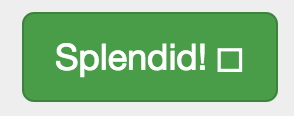
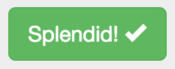

# Nesting and Imports: Set Up Your Stylesheets

In order to make the most of our new CSS preprocessor, let's set up our stylesheets for further development. We need to establish our file structure and set up our imports to allow us to write clean, well-organized code that makes the most of the SCSS nesting capabilities to create an obvious hierarchy.

## Locate your stylesheet
As we saw when we bootstrapped the site, the stylesheets for our project are located at `app/styles/`. As part of the bootstrapping process, a `main.scss` file was created and some styles were added there to support the project skeleton homepage.

Open `app/styles/main.scss` and observe the styles that have been pre-created for you. There is a `.browsehappy` style, which is an element that shows up when outdated browsers hit your page. (You can find that element, and the code that makes it appear,  in the `app/index.html` file.)

You will also see several styles that affect the content inserted into `app/index.html` for demonstration purposes. These show you how SCSS can be written, and you should start editing with just altering some of the values to experiment.

If you are running your server as you edit, you should see your page automatically update in the browser whenever you save your changes. This can be very handy for rapidly working on style definitions. Of course, what's happening is that when you run `grunt server`, there is a `watch` task that runs. The `watch` task monitors files in your app for changes, and when a change is detected it kicks off the whole build process. 

Pretty neat, right?

So although these style definitions are useful (you might also pay special attention to the way they write their media query to target mobile devices), they are not necessary. You may remove any of the styles that you wish. In general, it's not recommended to put styling directly into your `main.scss` stylesheet.

### Icon Font Path
The first line of your generated stylesheet is probably a variable definition:

```scss
$icon-font-path: "../../bower_components/bootstrap-sass-official/assets/fonts/bootstrap/";
```

This definition may not be correct. The path should point to wherever the Glyphicon font that comes with Bootstrap is located. You may not have noticed if the path is broken, but you can tell by looking at the button in the default web content. If you see a square, like this, then it is broken:



When the `$icon-font-path` variable is properly set, then the fonts work and the checkmark icon is visible:



Adjust the `$icon-font-path` variable so it points to the directory containing the Glyphicon fonts. (You may need to add an extra `../` to point to the proper directory--or modify the path further if you have altered your default locations.)

### Bower-managed area
The next section of code in `main.scss` (starting on line 2) is the Bower-managed area. Leave these comments and import statements in place so that Bower can add components to your project properly. These lines probably look like this:

```sass
// bower:scss
@import "bootstrap-sass-official/assets/stylesheets/_bootstrap.scss";
// endbower
```

Don't modify the comments or the code between the comments those lines will be managed by Bower if/when we add frontend components to this project.

## Setting up your `main.scss`

Your `main.scss` stylesheet should be an index of all your site's stylesheets. It should consist of a list of imports (with helpful comments about them if need be). You