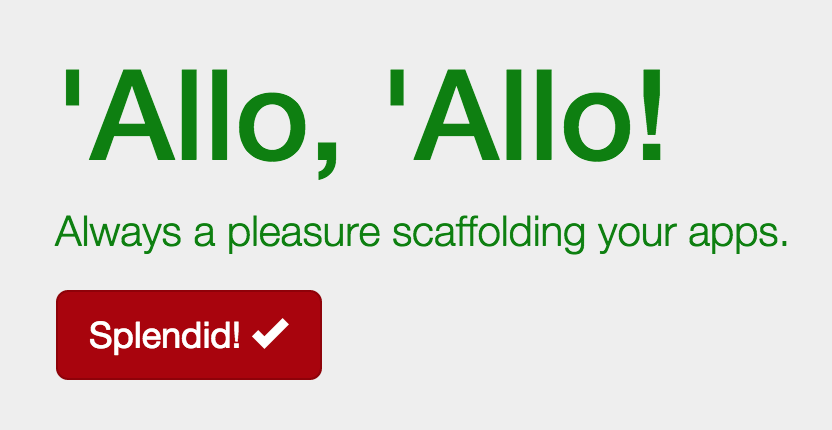

# Nesting and Imports: Set Up Your Stylesheets

In order to make the most of our new CSS preprocessor, let's set up our stylesheets for further development. We need to establish our file structure and set up our imports to allow us to write clean, well-organized code that makes the most of the SCSS nesting capabilities to create an obvious hierarchy.

## Locate your stylesheet
As we saw when we bootstrapped the site, the stylesheets for our project are located at `app/styles/`. As part of the bootstrapping process, a `main.scss` file was created and some styles were added there to support the project skeleton homepage.

Open `app/styles/main.scss` and observe the styles that have been pre-created for you. There is a `.browsehappy` style, which is an element that shows up when outdated browsers hit your page. (You can find that element, and the code that makes it appear,  in the `app/index.html` file.)

You will also see several styles that affect the content inserted into `app/index.html` for demonstration purposes. These show you how SCSS can be written, and you should start editing with just altering some of the values to experiment.

If you are running your server as you edit, you should see your page automatically update in the browser whenever you save your changes. This can be very handy for rapidly working on style definitions. Of course, what's happening is that when you run `grunt server`, there is a `watch` task that runs. The `watch` task monitors files in your app for changes, and when a change is detected it kicks off the whole build process. 

Pretty neat, right?

So although these style definitions are useful (you might also pay special attention to the way they write their media query to target mobile devices), they are not necessary. You may remove any of the styles that you wish. In general, it's not recommended to put styling directly into your `main.scss` stylesheet.

### Icon Font Path
The first line of your generated stylesheet is probably a variable definition:

```scss
$icon-font-path: "../../bower_components/bootstrap-sass-official/assets/fonts/bootstrap/";
```

This definition may not be correct. The path should point to wherever the Glyphicon font that comes with Bootstrap is located. You may not have noticed if the path is broken, but you can tell by looking at the button in the default web content. If you see a square, like this, then it is broken:


When the `$icon-font-path` variable is properly set, then the fonts work and the checkmark icon is visible:


Adjust the `$icon-font-path` variable so it points to the directory containing the Glyphicon fonts. (You may need to add an extra `../` to point to the proper directory--or modify the path further if you have altered your default locations.)

### Bower-managed area
The next section of code in `main.scss` (starting on line 2) is the Bower-managed area. Leave these comments and import statements in place so that Bower can add components to your project properly. These lines probably look like this:

```sass
// bower:scss
@import "bootstrap-sass-official/assets/stylesheets/_bootstrap.scss";
// endbower
```

Don't modify the comments or the code between the comments those lines will be managed by Bower if/when we add frontend components to this project.

## Setting up your `main.scss`

Your `main.scss` stylesheet should be an index of all your site's stylesheets. It should consist of a list of imports (with helpful comments about them if need be). You should strive for a clear, understandable structure. There are different philosophies about how to manage your styles and stylesheets, but they all generally boil down to managing two things:

1.  Making sure styles are named and organized in a way that makes sense. Styles that affect the same objects should go together. Styles that belong to the same part or feature of the site should go together. As much as possible, we wish to avoid making any surprises or confusion for other developers who may come along.
2.  Making sure individual stylesheets do not become overly cumbersome because they are way too long.

### Organizing files

Some sites might organize styles by specific function, something like this:

```bash
/app/styles/
|-- main.scss
|-- _buttons.scss
|-- _content.scss
|-- _layouts.scss
|-- _typography.scss
...
```

This approach works fine, especially when there aren't too many styles. Once a site grows very large, it may be beneficial to break up styles into other types of organization:

```bash
/app/styles/
|-- main.scss
|-- components/
    |-- _buttons.scss
    |-- _menus.scss
    ...
|-- modules/
    |-- _blog.scss
    |-- _checkout.scss
    ...
|-- _reset.scss
```

There are more formal methods of organizing styles (such as [SMACCS](https://smacss.com/)), and there are many, many hybrid and ad-hoc methods as well. It's worthwhile to spend a little time thinking about what makes sense in terms of organizaing your files.

### Make some stylesheets

Since we are just experimenting and we don't need too much in terms of styles, we will do a minimal stylesheet setup. We will create the following file structure for our `app/styles/` directory:

```bash
/app/styles/
|-- main.scss
|-- _content.scss
|-- _variables.scss
```
Create the `app/styles/_content.scss` file and add the following style definition so we will know when our new stylesheets have taken effect:

```sass
body {
    color: green;
}
```

Now you need to create `app/styles/_variables.scss`. To make this file, we're going to copy a file out of the Bootstrap files that Bower installed for us. In order to customize Bootstrap, a `_variables.scss` file is provided. This file sets values that we can alter or override to make Bootstrap fit our needs better. However, we **DO NOT** want to edit the `_variables.scss` file in the Bootstap module. We **must** make our own copy of `_variables.scss` in our `app/styles/` directory.

Find the Bootstrap variables file. It should be in:

```bash
bower_components/bootstrap-sass-official/assets/stylesheets/bootstrap/_variables.scss
```
(Note: The `bower_components` directory should be at the root of your project.)

Copy this file into your `app/styles/` directory. Once you have done so, open the file for editing. Find the line that defines `$brand-success` (probably line 22), and alter it like so:

```sass
$brand-success: #AA0000;
```

This turns the color for "success" styles in our project a dark red. Once we get these stylesheets connected to `main.scss`, you will see that the body text turns green and the button turns red.

### Setting up your imports

Now that we've set up our new stylesheets, let's modify `main.scss` to import those files. We will first add a line above the Bower-managed area that imports the `_variables.scss` file:

```sass
@import "variables";
```

**Please Note:** It's important to remember that in order to properly override the variables in Bootstrap, you must import your `_variables.scss` file **BEFORE** you import the `bootstrap.scss` file (which is what Bower has done for you).

Next, we will add an import below the Bower-managed area to include our `_content.scss` stylesheet:

```sass
@import "content";
```

Once we're finished, and with some helpful comments added, our `main.scss` stylesheet should look like this:

```sass
$icon-font-path: "../bower_components/bootstrap-sass-official/assets/fonts/bootstrap/";

// Override Bootstrap variables
@import "variables";

// bower:scss
@import "bootstrap-sass-official/assets/stylesheets/_bootstrap.scss";
// endbower

// Site-specific styles
// Add additional stylesheets below
@import "content";
```

**Remember:** When importing stylesheets in SASS, you do not include the underscore (`_`) or `.scss` filename extension.

Once you save this file, your server should automatically update and you should see that the text on your page is green and the button has now turned dark red:




