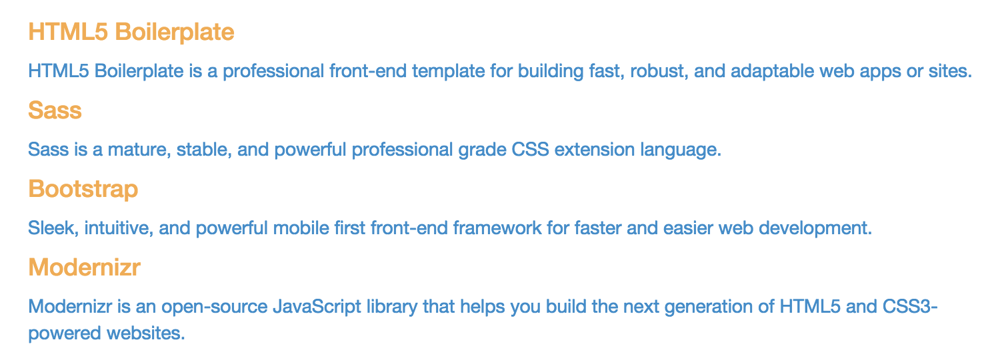

# Experimenting with Nesting

As mentioned before, SCSS allows you to use hierarchical nesting structure to create more specific styles. This can help you keep your files more organized (because styles that go together can be contained together), and it helps you overcome any style selector conflicts.

When nesting styles, you may define selectors within selectors. We saw the basic example earlier.

This SCSS:

```sass
.my-container {
    a {
        &:link, &:active, &:visited {
            color: red;
        }
        &:hover {
            color: green;
        }
    }
}
```
Makes this CSS when it is processed:

```css
.my-container a:link,
.my-container a:active,
.my-container a:visited {
    color: red;
}
.my-container a:hover {
    color: green;
}
```

All of the styles above are contained within `.my-container`. You can see how the `a` selector (which selects the `<a>` elements inside `.my-container`) is defined within the curly braces marking off the `.my-container` style. This is the "nesting".

The ampersands (`&` symbols) reference the parent selector, and modify it directly. Thus, `&:link` becomes `a:link`. If it were written without the ampersand (`:link`), the result would be `a :link`, which would be an invalid selector. You can [read more about referencing parent selectors on the SASS Documentation site](http://sass-lang.com/documentation/file.SASS_REFERENCE.html#parent-selector).

## Try it out

In order to try this out, let's define some styles for the `.marketing` section of the demo page. Add the following styles to your `_content.scss` stylesheet:

```sass
.marketing {
    h4 {
        color: $brand-warning;
    }
    p {
        color: $brand-primary;
    }
}
```

This code specifies that the `<h4>` elements inside the `.marketing` element should take on the `$brand-warning` color (which is a yellow), and the `<p>` elements inside the `.marketing` element should become the `$brand-primary` color (which is blue).

The CSS that will be compiled from this SCSS will look like this:

```css
.marketing h4 { color: #f0ad4e; }
.marketing p { color: #428bca; }
```

And the result in the browser should look like this:

