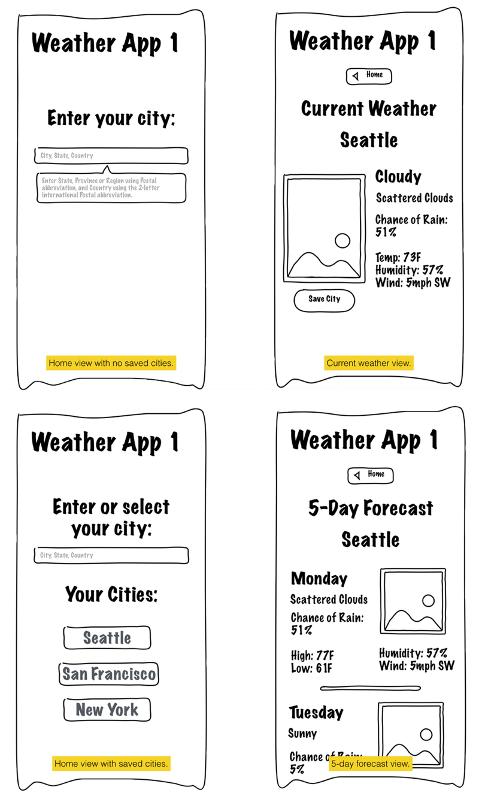

# Adding Data to the App
Most websites make use of a custom backend component. For example, many websites use a server-based application to manage business logic and data, which is then stored in a database that also resides on some remote server. The web frameworks we discussed a couple chapters back are largely designed to make that process of connecting data, logic, and template rendering much easier for developers.

For our purposes here, we do not actually require a custom backend component. We can create a useful application for our users that leverages local storage technology to keep user preferences and settings, and leverages third party data APIs to provide all the interesting content for our user. We can do all of this with no custom backend "engine" or database or anything else. We require only a static web server that can deliver our HTML, CSS and Javascript files to our users.

## The big picture concept
For this project, we will build a simple weather forecast application. It will allow users to enter their city, state, and/or country to select where they wish to see a forecast from, and then it will show them the current weather and a forecast for some number of hours or days. 

We will use [OpenWeatherMap.org](http://openweathermap.org) to provide our data. OpenWeatherMap (OWM) is a site that seeks to provide weather information in the same way that OpenStreetMaps.org provides street map information or Wikipedia provides encyclopedic information. OWM makes an [API](http://openweathermap.org/api) available for free to developers that will suit our needs for this educational project.

Ultimately, we will provide a way for users to store a list of cities so they can easily return to our app and pull up their preferred weather forecasts. We will do this using local storage techniques, which means the data will not sync for users between browsers or devices. For now, this will be an acceptable limitation (although it's easy to work around that with a little server-side storage).

Here are some wireframe illustrations of the webapp we will work on for the rest of this book:

This set of wireframes shows three different views (and two states of the "home" view), which we will build out over the next few chapters. There are many ways to enhance and otherwise customize this app to allow you to explore the areas of webapp building that you are most interested in. You can work on your interface design skills, experiment with animation to enhance the experience, or continue to build out a more robust weather application that can do more for the user. You can even use this basic app to build something like [DoINeedAnUmbrella.com](http://doineedanumbrella.com) or other weather-based jokes and artwork.

## Put the data in the app
Whatever else you decide to do with your weather application, it is essential to set up the data piping so that you can start to make use of all this rich weather information you can receive from OWM. In order to do that, you'll need to have an understanding of how an API works, how you can use it, and what you can do with it. We will cover all this and more as we set up your data models in this chapter.