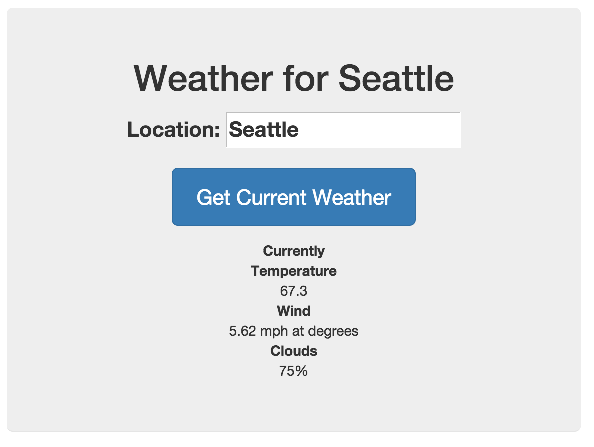

# Put the Data in the View
If you have constructed your `current` data model properly then you should now be able to use it in any Controller to pipe data into your webapp's views. In order to prove out our data integration, we will make a simple form interface so users can look up the weather for their city.

## Set up `MainCtrl` controller in `main.js`
In the file `app/scripts/controllers/main.js` there is a definition for the `MainCtrl` module. This is the module that controls the data and functionality on the main page of our site. We want to get rid of the default code that Yeoman generated for us and replace it with something that looks like this:

```js
angular.module('yourApp')
  .controller('MainCtrl', function ($scope, current) {
    $scope.current = current.query();
  });
```

Let's take a look at this code more closely. First of all, we are once again appending to the `'yourApp'` module, so you'll need to replace that with the name of your app. In the definition of `MainCtrl` we added a few things to the function parameters: `$scope` and `current`. 

As discussed in our previous overview of AngularJS, the `$scope` object is a special AngularJS object that manages the context of the view associated with this controller. The `$scope` object contains all of the variables defined for use in this view, as well as the different functions that can be added to HTML elements inside of our view. We will make extensive use of `$scope` in all of our controllers.

The other parameter references our `current` data model. Now that we've added it to the `MainCtrl` function parameters, we can reference `current` from inside `MainCtrl`. That's exactly what we do on the next line:

```js
$scope.current = current.query();
```

This line sets a variable in `$scope` called `current` equal to the results of the `query()` method on the `current` data model. Since we are not supplying any parameters in our `current.query()` call, the API should respond with our default query (for 'Seattle,us').

We should now have access to the `{{current}}` variable in our views.

## Set up the view
In order to display this information, we must modify our view so that it will show the data we have fetched from our API. Here is how the `app/views/main.html` should look in order to show some data from the OWM API:

```html
<div ng-app class="jumbotron" ng-controller="MainCtrl">
  <h1>Weather for {{current.name}}</h1>
  <p class="lead">
    <div ng-init="location='Seattle'">
        <p>
          <label for="location">Location:
            <input type="text" name="location" ng-model="location">
          </label>
        </p>
        <p>
          <button class="btn btn-lg btn-primary" ng-click="refreshCurrent()">Get Current Weather</button>
        </p>
      <dl>
        <dt>Currently</dt>
        <dd>{{current.weather.main}}</dd>
        <dd>{{current.weather.description}}</dd>
        <dt>Temperature</dt>
        <dd>{{current.main.temp}}</dd>
        <dt>Wind</dt>
        <dd>{{current.wind.speed}} mph at {{current.wind.deg}} degrees</dd>
        <dt>Clouds</dt>
        <dd>{{current.clouds.all}}%</dd>
      </dl>
    </div>
  </p>
</div>
```
As you can see, there are variable outputs peppered throughout this HTML. The `<h1>` heading shows the name of the city where the current weather is coming from. The content shows values from inside the data returned by the API. You can see that we are using the same field names and heirarchy as we saw in the data results when we were testing them using the Postman API browser.

If you run your server and view your webapp in the browser, you should now see the default results of the 'Seattle,us' query:



Congratulations! It's been a long road to get here, but this is the first time we're really working with serious data and a living application. Well, almost living...

## Refresh the data
Of course, one of the hallmarks of living apps is that you can do things with them, and right now if you type in the name of another city and click the "Get Current Weather" button, nothing happens. Right now, this button is not connected to anything. Notice in the code above the button contains a `ng-click` attribute:

```html
<button class="btn btn-lg btn-primary" ng-click="refreshCurrent()">Get Current Weather</button>
```

That `ng-click` attribute tells AngularJS that when this button is clicked it should execute the `$scope.refreshCurrent()` function. However, that function does not yet exist, so right now nothing happens. Let's fix that.

Since the HTML for our view already contains the `ng-click` attribute on our button, all we need to do is create the `$scope.refreshCurrent()` function in our `MainCtrl` inside of `app/scripts/controllers/main.js`. Here is what that controller will look like once we've edited it:

```js
angular.module('yourApp')
  .controller('MainCtrl', function ($scope, current) {
    $scope.current = current.query();

    $scope.refreshCurrent = function(){
        $scope.current = current.query({
            location: $scope.location
        });
    };
  });
```

Notice that all we've done is add a function called `$scope.refreshCurrent`. This function takes no parameters, and it only has one line: It sets the value of `$scope.current` to the result of `current.query()`, and it sends `current.query()` a `location` parameter that is equal to the value of `$scope.location`.

This might seem quite complex, so let's walk through what happens in the view as the user interacts with the webapp.

First, the user loads the view. The `$scope.current` value is populated with the default data returned by `current.query()`. The user sees this default data displayed in their browser.

Second, the user types a new location name into the text input. Since AngularJS has already bound `$scope.location` to that text input, the value of `$scope.location` is updated constantly as the user types. However, since the user must click the button to refresh the data, the information being displayed does not change.

Third, the user clicks the "Get Current Weather" button, which executes the `$scope.refreshCurrent()` function. That function queries the `current` resource again, but this time it sends the `query()` method a `location` parameter:

```js
$scope.current = current.query({
    location: $scope.location
});
```
Since `$scope.location` was already updated as soon as the user typed the new location into the text box, this new API request sends the updated location to OpenWeatherMaps.org, which responds with the new data.

Finally, since AngularJS knows that all the places where we display data are bound to that `$scope.current` variable, then it automatically updates everywhere that data is used in our view as soon as it receives the new data. We do not have to manually refresh the view or update any HTML elements by hand, which is a major advantage to using a framework like AngularJS. 