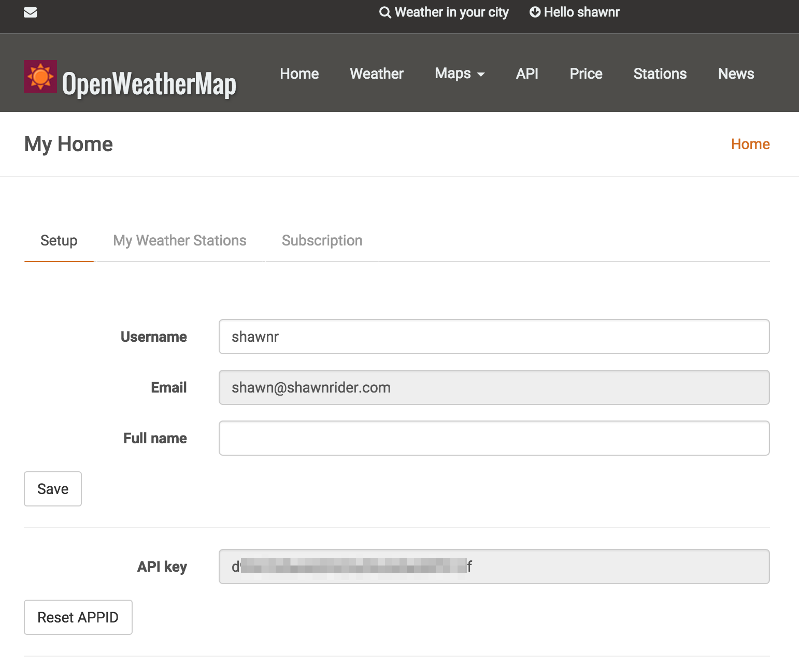

# Prerequisites for Using Data APIs
Most APIs you might leverage in a Single Page Application (SPA) will require you to sign up, and possibly even go through some approval process, in order to consume their data. For the purposes of experimentation, it's good to stick with "open" data APIs, many of which are provided by various government agencies, non-profit organizations, and various other outlets. Many for-profit companies offer very liberal API usage to developers, while others restrict their API access to approved partners. 

## Open Weather Map
For the purposes of this book, I will leverage the data available from OpenWeatherMap.org (OWM). This is a service run by a private company, but with very liberal usage policies. You can learn more about OpenWeatherMap.org on their About Us page. (Please note: Neither I nor this book is in any way affiliated with OWM. For the purposes of the work we will do here, you may substitute any other REST API service that will return JSON. There are a lot of those.)

In order to use OWM's API, you must register for an account. When you register for an account, you will be given an API key, which you can find on [your "My Home" page](http://home.openweathermap.org/) after you have logged in. (Click the "Hello" link in the upper right of the site if you can't find [your "My Home" page](http://home.openweathermap.org/).

The My Home page looks like this (please note the API Key field):

Now that you have your API key, you are ready to continue with the work in this chapter using the OWM API. 

## Exploring the API
Whenever I begin using a new data API, I like to spend a little time exploring the API documentation and trying requests using an API browser tool like [Postman for Google's Chrome browser](https://chrome.google.com/webstore/detail/postman/fhbjgbiflinjbdggehcddcbncdddomop?hl=en).

Postman allows you to construct HTTP requests to any API. You can set necessary headers, query parameters, form data, and more. Results are clearly displayed so you can truly begin to understand the shape of the data that comes back from the API. Each API will deliver a different type of data object, and all the attributes contained in these responses become available to you inside your AngularJS app once you set up your data models properly. 

That means you can use an API browser tool to get a clear view of what information exists in the data coming back from your API service. Since the API data objects are translated directly into your AngularJS models, you can easily see how to access the specific information you require for your purposes. 

These tools also help you form proper API requests. If your request is not properly formed, then you will not get the data you need back from the API service. Luckily, AngularJS makes it easy to create base request templates so you do not need to constantly be writing and rewriting requests, but it can still be tricky to work out how to form your request in the first place. A good API browser tool will help you formulate correct requests and will allow you to know exactly what you are getting back. You can even use it to help test edge cases and learn how the API responds if, for example, you send some data value it does not expect.

[The Postman Documentation site](https://www.getpostman.com/docs) has a lot of useful information, tutorials, and guides for using Postman to explore API services. You are encouraged to read up on how to use this tool, or find a similar tool you prefer and use that one. It is very essential to have a way to view the data coming into your app, and to test your app's API queries, apart from your custom Javascript code.

## Using other APIs
You can use the patterns described in this book to use any other REST API that serves JSON results. There are many, many APIs that fit that description. Some APIs require you to do more arduous authentication or to have your app approved before you will be granted developer privileges. Other APIs have steep charges for using them, and although you may be able to develop against them reasonably it would be prohibitively expensive to release a website using that API. These considerations and more should inform your decision as you look for APIs.

As you look for APIs to use in your projects, some of these resources may help:

* [US Government's 18F project to encourage developers to use US Government Data APIs](http://18f.github.io/API-All-the-X/)
* [Mashape Directory of Public APIs](https://www.publicapis.com/)
* [Programmable Web API Directory](http://www.programmableweb.com/apis/directory)