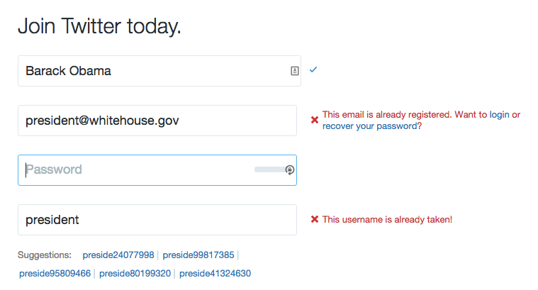

# Messaging Concepts
In web applications, being able to let the user know about changes to the system they are using is a critical aspect of designing a responsive, friendly system. In order to communicate changes that may not be possible to represent more clearly to the user through any other means, we often use "messages". Sometimes these messages take on the guise of "alerts" or "notifications", and they are used in many ways.

AngularJS allows us to use a built in messaging tool to easily define messages that can be used in a view and then to trigger them without having to write a bunch of duplicate code. This system is useful and pretty straightforward to make work. It is ideal for us because in our weather app we have a need to communicate when people successfully save a city. There is currently no indication that the app has actually saved the city when you click the "Save City" button. In order to discover that the city has actually been saved, users must click back to the home screen, which is inconvenient.

We will implement messages to indicate that we have successfully saved the city, and to indicate when the user tries to save a duplicate city. (Of course, we could also remove the "Save City" button altogether in order to prevent duplicate saves, and that would be the better solution. But for the purposes of this exercise, we're going to leave the button there.)

## The basics of messaging in websites and apps
There are many ways to use messaging in websites and apps, and developers are always coming up with clever new ways to indicate changes in content and system status. But a few conventions have grown up around messaging, and for our purposes here we are not going to "reinvent" messages.

When generally thinking about messaging, there are two major types of messages: global and local. These are both useful types of messages and most apps and sites make use of both of them. Understanding when to use which type of message is important to getting messaging right in your application.

### Global messages
Global messages apply to everything the user is seeing. On Twitter, for example, as you read tweets in your timeline you may notice an alert that shows up at the top of your timeline telling you that there are a number of new tweets available to read. In many email clients, when you receive a new message, or when you file a message away, you will see an alert at the top of the screen. 

Global messages are great for letting us know that things are happening that generally apply to what we're doing. Depending on how they are presented, they can be more or less effective. For example, the alert pictured above is only visible when you scroll to the top of the page. If you are lower on the page you will never know how many tweets you have.

### Local messages
Local messages appear closer to "where the action is". This is commonly seen in form field validation, especially when we're filling out more complex forms. In order to indicate where we have gone wrong, messages may be shown very close to the field (or in some way even styled as part of the form field).

Here is an example from Twitter's signup form:

As you can see in the image above, as you fill in the form the Twitter website is checking to see if your information is valid. It indicates to you clearly if you have successfully filled in the field or if you must change your information. Twitter even goes so far as to suggest alternate usernames based on the data you've filled in when your chosen name is unavailable.

## Implementing messages in the weather app
In order to experiment with displaying messages using the `ngMessages` directive in AngularJS, we will add a global message to the current weather screen. When users click the "save city" button, they will see a message that indicates to them whether or not the action has been successful. This should greatly enhance the user experience, eliminating the confusion over whether or not the city was actually saved.

Here is what we hope to see after we successfully save a city:

In order to do that, we will make a couple of small tweaks to our `app/views/current.html` and `app/scripts/controllers/current.js` files.
