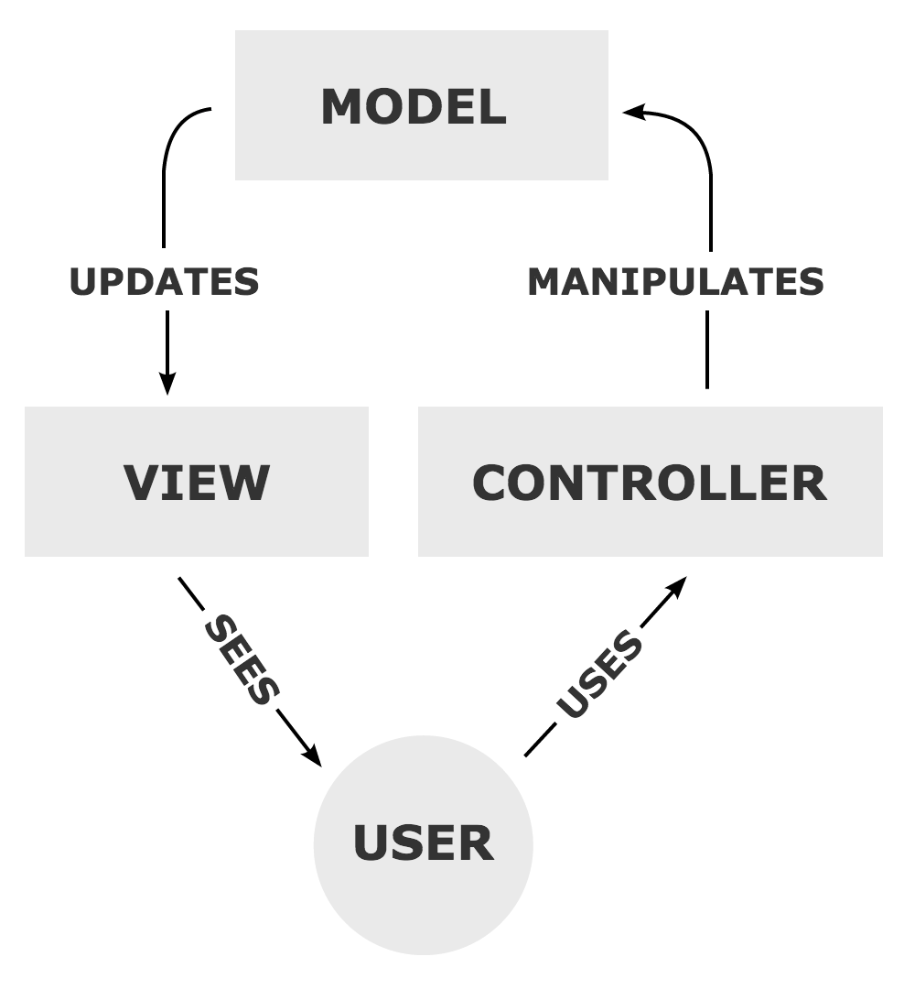

# Model View Controller
Application frameworks all have an "opinion" about how projects should work. That is, they all define a way that the pieces of the framework go together, and that method of organization is often unique to the specific framework. If you, for example, have become familiar with Rails, you would not necessarily know how to build a website with Sinatra, although those are both Ruby-based web frameworks.

Fortunately, there are some common concepts that tend to be at work in these application frameworks, and understanding these base concepts is useful for learning any new framework.

## The MVC approach
Most web application frameworks will be described as "MVC" frameworks. This means they, in some way, implement the "Model View Controller" approach to application design. This is an approach that has been in use since the beginning of graphical computing, and it defines three basic concepts that can be applied to almost any application.

[(Ilustration used courtesy Regis Frey.)](https://en.wikipedia.org/wiki/File:MVC-Process.svg)

### Model
The "model" represents the data in the system. All the information and the algorithms that make that information useful are rolled up into the concept of the model. It is our model of whatever concept, object, or event we are working with in our application. This model retrieves data, stores data, and manipulates data to make it useful to our users.

As an example, imagine a Twitter application. The "model" would define how to fetch data from Twitter, how to manipulate the data, and how to post data back to Twitter. The model is busy stewarding the data as it moves through the application.

### View
The "view" is made up of the information we show to the user. This view is informed by the model, and it provides an audiovisual interface to the information the user is working with.

In the example above, our Twitter app may have several views: We might view our feed with all the posts from the accounts we follow. We might also have a view that shows just one Tweet. And we might have a view that shows the profile information for a Twitter user. 

### Controller
The "controller" provides an method for the User to interact with the application. The "controller" communicates the user's intention to the model, which then updates the data in the system and, in turn, updates the view the user sees.

In our example Twitter app, one controller element that could be presented to the user would be a form for sending a new Tweet. Other controller elements could include the Favorite and the Retweet buttons. All of these interface elements would result in the controller sending information back to the model that would ultimately result in the data in the model being updated and the views being updated as well.

## The virtuous cycle
The three components of an MVC system work together to keep the application responsive to the user and constantly updated. Although this core concept is incredibly popular, frameworks that implement the idea of an MVC approach are diverse and varied. It's critical to understand the basic concept here, but also critical to learn the specifics of whatever framework you are working with.
