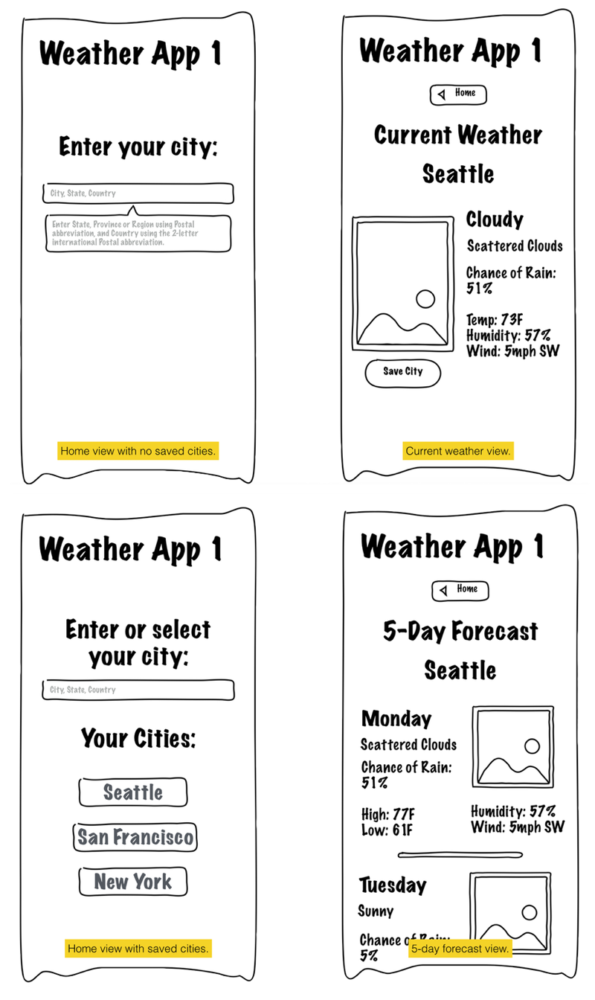

# Managing and Using Data in Your App
In this chapter we will dig into more of how to manage and use data in our app. We will add the remaining functionality that will make our app a real, functional weather tool for our users. As in the previous chapter, we will be working toward our basic concept of a weather app. This concept is outlined in the four wireframes we used previously:

So far, we have laid the groundwork for how we can call API endpoints on the OpenWeatherMaps.org API in order to get data into our app. However, in addition to displaying the current weather in a location, we want to provide a more user-friendly experience. 

The core features of our app will be:

1. Find a city you wish to view weather for.
2. View the current weather for that city.
3. View the forecast for that city.
4. Save that city into a list of quick-links so the user can select from their list of preferred locations rather than typing in the city name each time.

These are the features that will make up our core application, and once we have these, we will have an app that offers some real utility to our users. This is what is called in the web industry an "MVP" or "Minimum Viable Product". It is not a stopping point in terms of our app's entire life, but it is a major milestone where our app is delivering enough basic functionality to be useful.

We can start to share our MVP and get feedback from users about what to improve next. You probably already have ideas about things that would be handy to have in the app (like removing favorites? or setting a default city so users can see weather data right away?).

## Covering ground
In this chapter we are going to cover a good amount of ground. We will create a couple of new views, a few new model data resources, and we will rearrange where we put the current weather functionality we have already built. For the most part, we are repeating what we have done previously, and repetition is very valuable at this point. If you feel you need more repetition, you are encouraged to add an additional view using one of the many other endpoints available through OpenWeatherMap.org (historical data, weather station data, etc.).

## One more thing
The one new thing we will bring into play is an AngularJS module, [ngStorage](http://ngmodules.org/modules/ngStorage). This module allows you to use a browser feature called `localStorage`, which stores data in the user's web browser. This is a modern approach to storing information locally for users, and as a developer you can use it to enhance your site in many ways.

In the context of our weather app, we will use the `$localStorage` object to store the list of favorite cities so we can keep those handy for our users. By using the `ngStorage` module, which gives us the `$localStorage` object, we can easily keep our data synced and safe with fewer lines of code required. 

