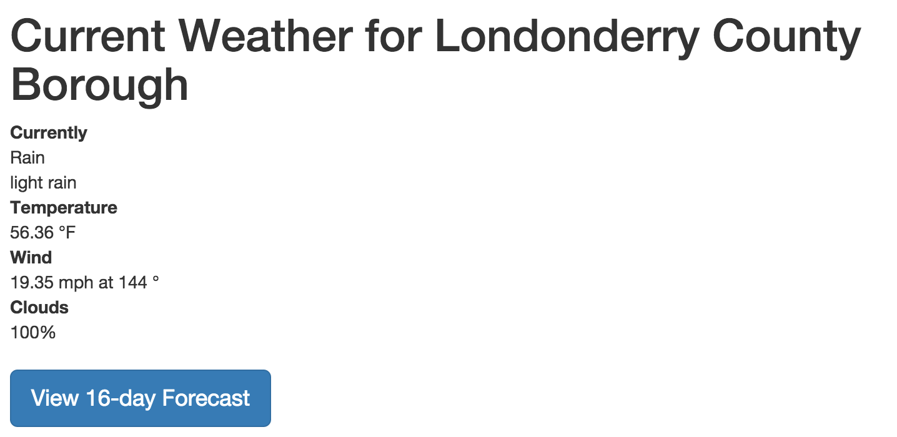

# Creating the `current` Route
To create a route for our "current weather" view, we will use the Yeoman generator once again. This time, we will run the following command in our project:

```ssh
yo angular:route current
```

This command will create a controller called `CurrentCtrl` in `app/scripts/controllers/current.js` and a template called `current.html` in `app/views/current.html`. It will also add this entry to your `app/scripts/app.js` file:

```js
.when('/current', {
    templateUrl: 'views/current.html',
    controller: 'CurrentCtrl',
    controllerAs: 'current'
})
```

We will need to alter this route in one small way to get things working. We will add a "route parameter" called `:cityID` to the path for this route. That route parameter is something we can pick up in our controller, so we can use that information to change the response this view delivers.

Here is how your route definition will look after you add that parameter:

```js
.when('/current/:cityID', {
    templateUrl: 'views/current.html',
    controller: 'CurrentCtrl',
    controllerAs: 'current'
})
```

## Set up the controller
Now that we have the route defined and all our basic files in place, we can edit them to bring our current weather view to life. First, jump into `app/scripts/controllers/current.js` and begin editing your `CurrentCtrl` Controller.

You will need to add `$scope` and `$routeParams` to your controller. We will use those to access and store info. You will also need to add `current` to your controller, so you can access the current weather data API from OpenWeatherMap.org.

Once you have all those pieces available in your controller, you can easily write the code needed to set the `$scope.cityID` and make your data call:

```js
angular.module('yourApp')
  .controller('CurrentCtrl', function ($scope, $routeParams, current) {
    $scope.cityID = $routeParams.cityID;

    $scope.currentWeather = current.query({
        cityID: $routeParams.cityID
    });
  });
```

Notice that we are storing the `cityID` in a specific `$scope` variable, more to have it easily handy than anything else. The `$routeParams` object makes any route parameters available for your use. Since we called our parameter `cityID` in the route definition, we can access it with that same name as `$routeParams.cityID`.

Using our updated data resource, we can easily get our current weather data. Now that we have that data streaming into the `$scope.currentWeather` variable, we can build our view template.

## Set up the view template
The view template created for us by Yeoman is the file `app/views/current.html`. Inside you will find some placeholder content. You can replace that with content that presents the current weather data to our users:

```html
<h1>Current Weather for {{currentWeather.name}}</h1>

<dl>
    <dt>Currently</dt>
    <dd>{{currentWeather.weather[0].main}}</dd>
    <dd>{{currentWeather.weather[0].description}}</dd>
    <dt>Temperature</dt>
    <dd>{{currentWeather.main.temp}} &deg;F</dd>
    <dt>Wind</dt>
    <dd>{{currentWeather.wind.speed}} mph at {{currentWeather.wind.deg}} &deg;</dd>
    <dt>Clouds</dt>
    <dd>{{currentWeather.clouds.all}}%</dd>
</dl>

<p><a ng-href="/#/forecast/{{cityID}}" class="btn btn-lg btn-primary">View 16-day Forecast</a></p>
```

Since we already figured out where the data is located inside the object returned by the OWM Current Weather API it was easy to place all of our information on the page. We can now click from the home screen to the current weather screen, and you should see something that looks like this in your browser:



## Let's do that again!
Now you can search for cities and then click in to view more weather details. Notice that at the bottom of the template code above there is a link to a whole new route: `/*/forecast/{{cityID}}`