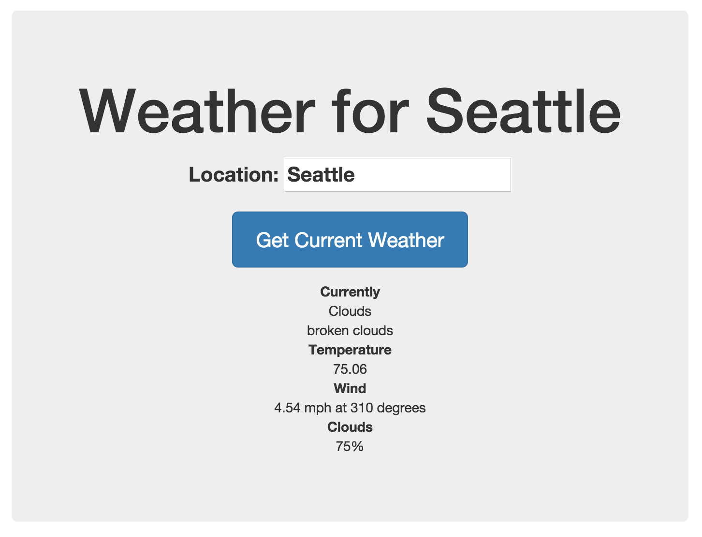
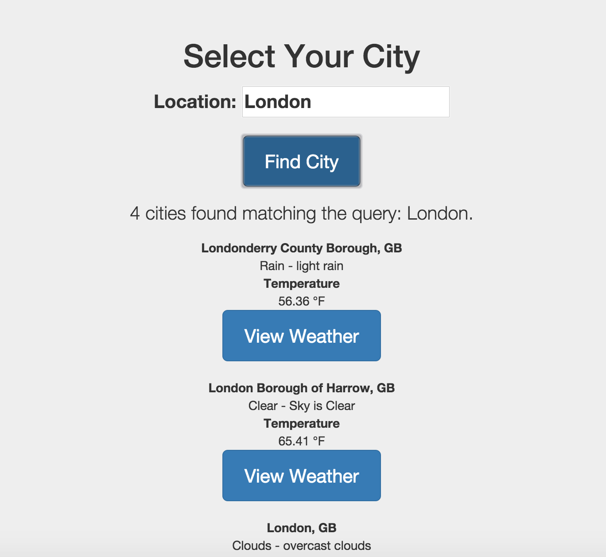

# Revising the Home Screen (`main`)
Our current "home" screen is known within our app as `main`. It is the `app/views/main.html` file powered by the `app/scripts/controllers/main.js` file, which contains the `MainCtrl` Controller object. Our home screen currently shows you a text input and the current weather data:

We will revise this output so that on the home screen the user is prompted to search for a city, and then they are shown a list of cities they have saved to their preferred locations list. It will end up looking like this:

In order to do this, we will need to revise the home screen once again. We will alter the `MainCtrl` object so that it handles the city search. We will leverage a different OpenWeatherMap.org API endpoint called the "Find API". The Find API allows you to search for cities so you can, for example, show your user both Paris, France and Paris, Texas to allow them to specify which "Paris" they mean. City names are not unique in the world, so this sort of search functionality is crucial to making a useful weather app.

## Home screen update tasks
In order to update the home screen, we will do the following:

1. We will make a new model data resource called "citysearch". This resource will be set up to make calls to the "Find API" on OpenWeatherMap.org.
2. We will revise the `MainCtrl` controller to call the "citysearch.search()" method to retreive data about cities.
3. We will show the user a list of cities we've found, and allow them to click in to a more detailed weather data view (based on the current weather and forecast data we will pull in later this chapter).

For now, we will ignore the "save city" feature. We will put the "save city" button on one of the detail pages about the city's weather.