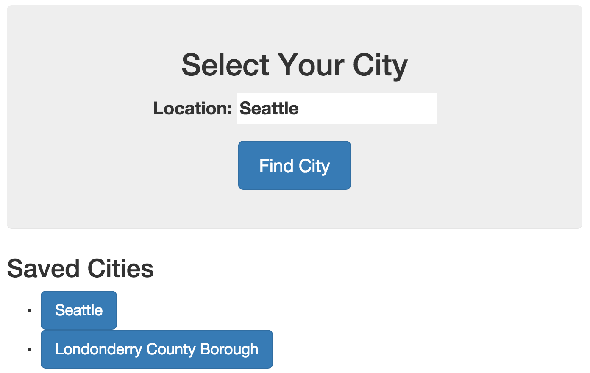

# Show List of Saved Cities
Now that we have a way for users to save their preferred locations, it is critical to give them a way to view and select those saved cities. We will display the saved cities list below our search box on the home screen. The home screen view is controlled by the `MainCtrl` Controller, and rendered in the `app/views/main.html` template. We will modify these two files to display saved cities to our users.

## Modify the `MainCtrl` Controller
In the `MainCtrl` Controller we will have to make a couple of changes. As with the `CurrentCtrl` Controller, we will need to make `$localStorage` available to the controller:

```js
.controller('MainCtrl', function ($scope, citysearch, $localStorage) {
```

Once we've added `$localStorage` to the controller declaration, we can add a quick mapping to a `$scope` variable so we can use `$localStorage` data inside of our template. Add this line to your controller:

```js
$scope.storage = $localStorage;
```

That allows us to reference `storage.savedCities` in the template to access our list of saved cities. here is the entire `MainCtrl` Controller:

```js
angular.module('yourApp')
  .controller('MainCtrl', function ($scope, citysearch, $localStorage) {
    $scope.citiesFound = citysearch.find();
    $scope.storage = $localStorage;

    $scope.findCities = function(){
        $scope.citiesFound = citysearch.find({
            query: $scope.location
        });
        $scope.searchQuery = $scope.location;
    };
  });
```

## Add saved cities to the template
Now that we have made the `$localStorage` data available to our template, we can modify `app/views/main.html` to show a list of saved cities with links to view their current weather. To facilitate that change, we can add a section below our search results display:

```html
<div ng-if="storage.savedCities">
  <h2>Saved Cities</h2>
  <ul class="saved-cities-list">
    <li ng-repeat="city in storage.savedCities">
      <a ng-href="/#/current/{{city.id}}" class="btn btn-lg btn-primary">{{city.name}}</a>
    </li>
  </ul>
</div>
```
Looking at the code above, we can see that this div will only display if there is data stored in the `storage.savedCities` variable (look at the `ng-if` directive to see where that is specified). If we do have some saved cities, then we will show a heading and a list of links.

Notice that the `<li>` elements repeat for every `city in storage.savedCities`. On the `<a>` elements we use the `ng-href` directive to specify the URL for viewing that city's current weather data, and we use the `city.name` variable to provide the link text.

Once we have made those changes, view your app and click into the current weather for any city. On the current weather screen, click "Save City" and then return to the home screen. You should now see your saved city listed below the search box like this:



If you see something resembling the image above, then congratulations. You have now completed all of the basic features to make your weather app run.