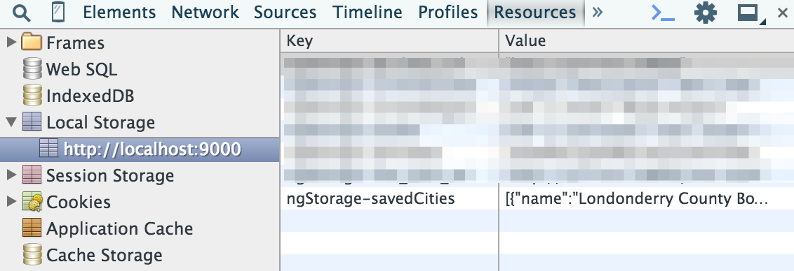

# Store and Retrieve Locations
Most weather apps and websites allow you to store a list of your preferred locations so you can easily refer to them when you return to the app. We will allow our users to store their chosen locations and then access those cities in a list on the home screen of our location. They can then click into one of the cities from their list, or they can search for other cities.

## Add the ngStorage module
In order to use the `localStorage` feature of modern web browsers, we will install the [ngStorage](http://ngmodules.org/modules/ngStorage) module for use in our project. This will make the `$localStorage` object available to our controllers so we can use locally stored data easily throughout our application.

We install ngStorage with Bower:

```bash
bower install --save ngstorage
```

You may notice that running this command adds a line to your `app/index.html` file with a `<script>` tag pointing to the ngStorage file. In addition to that, we must manually add the `ngStorage` module to our list of required modules in our app definition (which is in `app/scripts/app.js`). The first part of your app definition should look like this after you add the `ngStorage` module:

```js
angular
  .module('test3App', [
    'ngAnimate',
    'ngAria',
    'ngCookies',
    'ngMessages',
    'ngResource',
    'ngRoute',
    'ngSanitize',
    'ngStorage', // added to enable localStorage features
    'ngTouch'
  ])
  .config(function ($routeProvider) {
  //  ... additional code...
```

This addition makes the ngStorage Javscript module and it's components available in our application, but we must still let our controllers and other object know about the object before they use it.

## Modify the `CurrentCtrl` Controller
The `CurrentCtrl` Controller is the controller in charge of rendering our current weather view in the `app/views/current.html` template. This controller will be used to "save" our city. In order to add a "save" button to the template, we need to make a function that will add the city to our list of saved cities. And in order to make that happen, we need the `$localStorage` object to be available to the `CurrentCtrl` Controller.

First, add the `$localStorage` dependency to your controller declaration:

```js
.controller('CurrentCtrl', function ($scope, $routeParams, current, $localStorage) {
```

Once you have that in place, you can use it in a function that can be applied to a save button via the `ng-click` directive. Here is what that function will look like:

```js
$scope.saveCity = function(city){
    var cityData = {
        'name': city.name,
        'id': city.id
    };
    if (!$localStorage.savedCities){
        $localStorage.savedCities = [cityData];
    } else {
        $localStorage.savedCities.push(cityData);
    }
};
```

You can add a button to the `app/views/current.html` template like this:

```html
<p><button class="btn btn-sm btn-primary" ng-click="saveCity(currentWeather)">Save City</button></p>
```

Once you put all those pieces together, you should be able to save the city. Now, we haven't added any interface indication that the city is saved, so if you're looking to verify that our city was saved, you should inspect the page in developer tools and click to the Resources tab. You can then twirl down the "Local Storage" list and view local storage for the domain your site is running on. You should clearly see the entry made when you clicked the button:



Once you've made those changes, we can output the list of saved cities on the home screen so a user can easily click into the weather data for any of their saved cities.