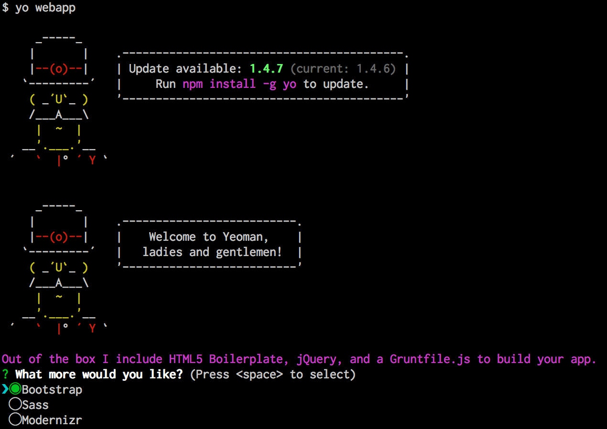

# Bootstrap a Test Project
In order to get used to all the pieces of our new develpment environment, we will create a simple test project based on a common Yeoman generator template. The `generator-webapp` template puts the key pieces of the Yeoman Workflow into place, giving you an HTML file, Javascript files, SASS support, and more.

Getting this project up and running is not too difficult. First, you should open your terminal and change directory into whatever directory you cloned your test Github repository into. 

Run the following command to generate a project skeleton based on `generator-webapp`:

```bash
yo webapp
```

You should see the following information display:

