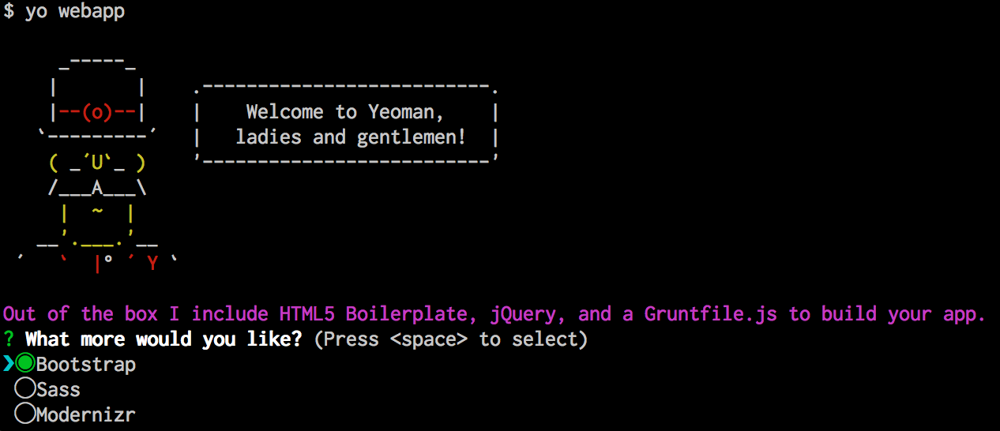
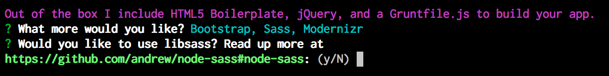
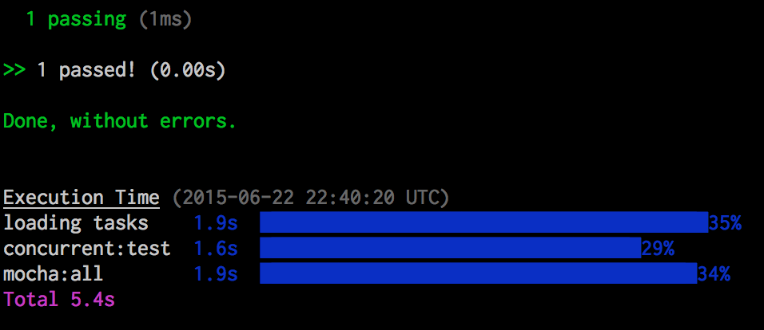

# Bootstrap a Test Project
In order to get used to all the pieces of our new develpment environment, we will create a simple test project based on a common Yeoman generator template. The `generator-webapp` template puts the key pieces of the Yeoman Workflow into place, giving you an HTML file, Javascript files, SASS support, and more.

Getting this project up and running is not too difficult. First, you should **open your terminal and change directory into the directory where you cloned your test Github repository**. Do not run the Yeoman generators in random directories because you will end up with a mess of files. Please keep this in mind when generating your sites.

Run the following command to generate a project skeleton based on `generator-webapp`:

```bash
yo webapp
```

You should see the following information display:



Many Yeoman generators allow developers to select optional components and features. In this case, the generator is asking us if we want to use the [Bootstrap CSS Framework](http://getbootstrap.com), [SASS CSS](http://sass-lang.com/) Preprocessor, and [Modernizr](http://modernizr.com/), a Javascript polyfill that makes HTML5 sites work better on old browsers.

We want all of those in our project, so use the `up` and `down` arrow keys to move through the list, and the `spacebar` to select each option. Make sure each option has a bright green dot next to it. Once you've selected all the options, press `enter` to move on.

In some cases, you will need to answer additional questions. Whenever you use SASS, generators will often offer you the option of using a module called `node-sass` instead of the SASS Ruby Gem. Unless you have consciously installed the Ruby Gem, it's advisable to use `node-sass`, so when it asks us this question, we will say "y", we want to use `node-sass`.



Press `y` and then `enter` to begin the build.

Now that you have built out your project skeleton, it's a good idea to run the tests and see if everything is working. To do so, run this command in your terminal:

```html
grunt test
```

That command should yield output that looks like this at the end:



If you see those results, then your site should run.

## Running Your Local Dev Server
In order to work on your site you will, of course, need to run a local dev server. This can be accomplished by running the following command:

```html
grunt server
```

That command will run the server in your terminal and will open your web browser to show you the default project template page.

The generator has created a set of directories and files that make up a project. There are many files in the system, but here is an abbreviated description of that structure:

```html
.git/
.bowerrc
.editorconfig
.gitattributes
.gitignore
.jshintrc
Gruntfile.js
app/
bower.json
bower_components/
node_modules/
package.json
test/
```

Your website itself is located inside the `app/` directory. All of the files you will modify to make changes to your website are located in that directory. Here is what the layout of that directory and the files within looks like:

```
app/
|-- favicon.ico
|-- images/
|-- index.html
|-- robots.txt
|-- scripts/
    |-- main.js
|-- styles/
    |-- main.scss
```

You may now open up the index file in your `app/` directory within your project (`your-project-dir/app/index.html`). All of the files that form your webapp will be contained in this `app/` directory. Underneath the `app/` directory you will find `app/styles/` and `app/scripts`. In each of those directories you will find `main.scss` and `main.js` files respectively. 

These three files, `app/index.html`, `app/styles/main.scss`, and `app/scripts/main.js` are the main files we will edit to customize this experiment to be our own site. For now, let's make some modifications to see how our auto-refresh preview works.

## Making Changes
Open the `app/index.html` file in your favorite editor. Find the `<h1>` tag where it says "'Allo! 'Allo!" and change that to say something unique. Save the file.

Now return to your web browser. Your changes should update automatically so you see your altered text instead of the default Yeoman greeting.

Your local server is listening for changes to the files that make up your site, and when it detects a change it will update the page in your browser automatically. This can be very convenient. 

This works with all your files. Open `app/styles/main.scss` and add the following style to the stylesheet:

```css
h1 {
    color: green;
}
```

Now save the file and you should see that the `<h1>` on the page has now turned green.

If you look at the output in your terminal window, you will notice that Grunt is actually outputting all the stuff it's doing when you change files. It rebuilds the site almost instantly every time you save a file.

## Commit and Push Your Changes
Once you've finished messing around with your new webapp a bit, commit and push our changes to your repository on Github. This way you can share your work, and you have an off-site backup. It's important to always commit and push your work before you move on to another task.

If you're using the Github app, then you will just need to go back into the app, commit and then "Sync" your changes.

If you're using command-line Git, here are the commands to commit and push your code.

First, you may wish to check the status of your repo:

`git status`

Then you will need to add changed files. You can add them one file at a time, or all at once like this:

`git add -A`

That command stages your changes, making them ready to be committed. Now we must make the commit, which sets these changes into the history of our repository:

`git commit -m <YOUR MESSAGE HERE>`

Finally, you must push your changes to Github. Since you cloned from Github, that server will be known as the `origin`. When you push it will automatically send your changes back to the `origin`.

`git push`

You should now be able to visit your repository on Github and see your changes.